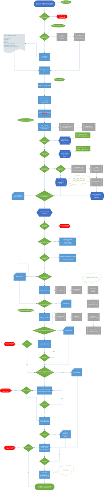

# Zorro: Just Batch Scripts, Not the Legendary Swordsman

## What the hack does Zorro do?
Zorro setup ME/MII development environment based on SAP NetWeaver JAVA AS for you. With one click, within one hour, otherwise it would spent you 2-5 days to set up. You may get to know how long this installation process would be, and how complex and difficult it is to write your first line of code for SAP ME/MII from the resized flowchart image in the below.

Basically you need to finish all these tasks in sequence successfully to start development, which would be a nightmare actually.

You may read the [task list](documents/task-list.md) for fun and a brief [implementation notes](documents/impl-notes.docx) to kill time. You may also check the [original visio document](documents/workflow.vsdx) for more details.

## Why the hack you call this project Zorro?
I have no other choice, man. Customized program name must start with 'Y' or 'Z' according to SAP naming convention, I have used a wonderful name [_**YNOT**_](https://github.com/ny83427/ynot) and had to find a meaningful name starting with 'Z'. The SwordMan with mask came to my mind suddenly, so it's done. Don't argue with me anymore man, I know you love the legend much.

## How the hack can I use Zorro?
You just can't, man. There are too many installation files you are not able to get legally unless you become a SAP employee and work in ME/MII teams - in that case you might be able to use a evolved version improved by someone, or it just disappeared as no one maintain it anymore.

## Then why do you open source here?
Why not? You cannot use Zorro but also you don't need to use Zorro, right? However, you may have some idea about SAP NetWeaver and its Java AS development, and what's more important, you would have an example of automate everything you can, and a spirit of JUST DO IT.

## OK. Then what's your motivation to create Zorro?
Initially I just want to have a try and actually didn't expect it to be done, as the process is too long and complex for me at that time. But after the first prototype finished and NetWeaver Java AS 7.31 installed in unattended mode successfully, I was greatly encouraged and want to proceed further, then step by step, one by one I found solutions to resolve most of the issues, including but not limited to install MaxDB/SqlServer/Oracle sliently, update NetWeaver Kernel automatically, update ME/MII software components automatically, assign administrator roles automatically and etc. Even myself was surprised to see this work finished. Then I started to share my work among teammates and some of them are shocked. New colleagues all use Zorro to setup their environment instead of finish the task list manually, which was really exciting.

When I look back on those days and the scripts, code I written, I can find many naive implementations, dirty workarounds and other ugly stuff. However, at that time it's not what you can, but what you do for others matters. There are many abler teammates who can do this job far better than me, but it's me stick to the end and make it done, and saved many hours for my team.

Meanwhile, if I know Selenium or JXBrowser at that time, Zorro would reach the promise land finally, as there are some CTC tasks difficult to simulate using Jsoup/HttpClient but relatively easy in WebDriver. I wish I can know them earlier, because these CTC tasks still need to be performed manually before I leave SAP. However I have no regret, because I had tried my best. I cannot make Zorro better anymore, at that time.

S.D.G